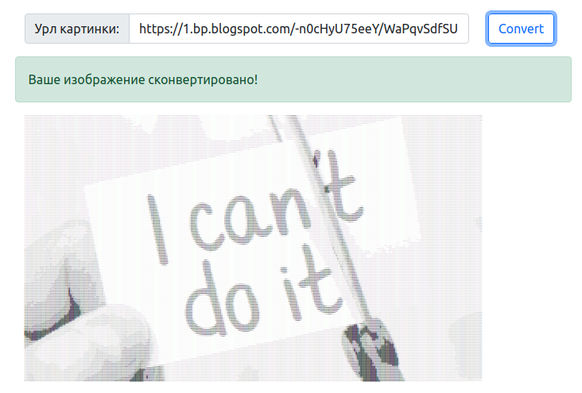
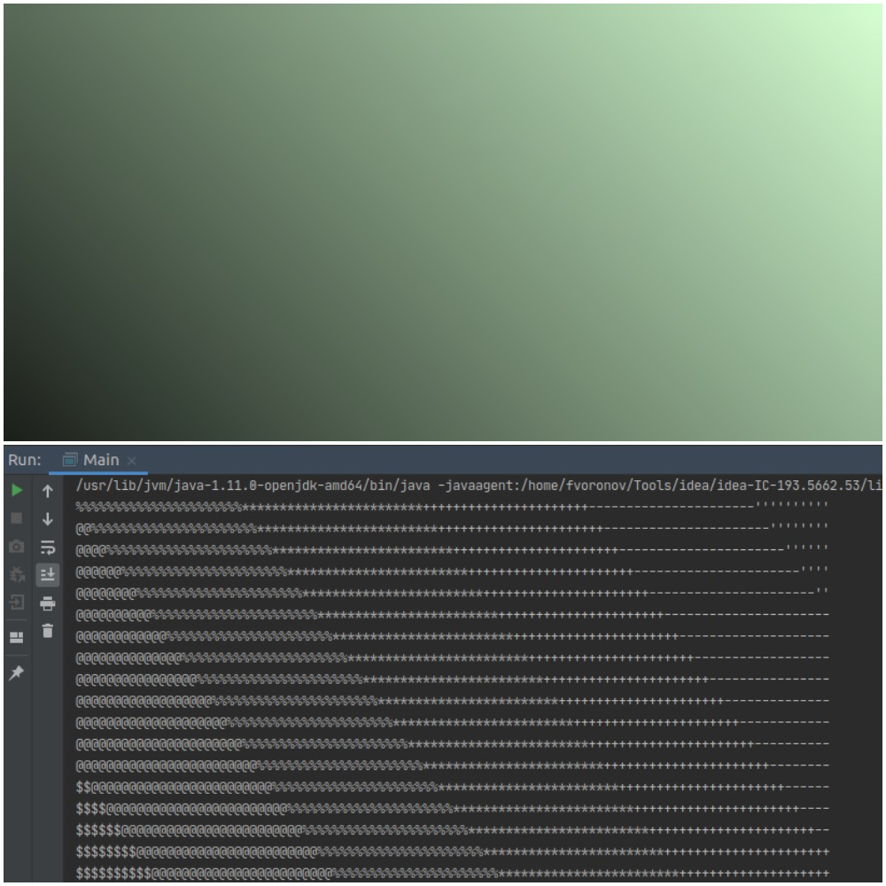

# Конвертер в текстовую графику

Вас пригласили поучаствовать в разработке приложения, умеющего скачивать картинки по URL и конвертировать изображения в текстовую графику (т. е. текст из разных символов, которые в совокупности выглядят как изображение). Вот пример его работы (картинка на нём — это текст из мелких символов):




## Структура проекта

| Класс / Интерфейс      | Для чего? |
| ----------- | ----------- |
| `BadImageSizeException`      | Класс исключения, которое вы будете выбрасывать       |
| `TextColorSchema`   | Интерфейс цветовой схемы, который вы будете реализовывать        |
| `TextGraphicsConverter`   | Интерфейс конвертера картинок, который вы будете реализовывать        |
| `GServer`   | Готовый класс сервера, который будет использовать ваш конвертер; вам туда лезть не нужно        |
| `Main`   | Запуск приложения. В нём запускается сервер, также в нём можно будет конвертировать картинки в текстовые файлы без сервера        |

## Требования к конвертеру
Самый главный метод - это метод `convert`, который принимает параметром урл в виде текста (например, `"https://raw.githubusercontent.com/netology-code/java-diplom/main/pics/simple-test.png"`), внутри метода качает и анализирует картинку, после чего отдаёт значение типа `String`, в котором содержится это изображение в виде текстовой графики. В конце каждой строчки текстового изображения находится символ переноса строки, который в джаве пишется как `\n`.

Пример работы конвертера, результат работы которого выводим в консоль:
```java
        String url = "https://raw.githubusercontent.com/netology-code/java-diplom/main/pics/simple-test.png";
        String imgTxt = converter.convert(url);
        System.out.println(imgTxt);
```

В итоге мы видим такой результат, где более тёмные участки заменяются на более "жирные" символы, а светлые на более незаметные символы:



Также интерфейс конвертера требует от него иметь возможность вытавлять ему определённые настройки перед конвертацией:
- Можно установить максимально допустимое соотношение сторон (ширины и высоты); если метод не вызывали, то любое соотношение допустимо;
- Можно установить максимально допустимую высоту итогового изображения; если метод не вызывали, то любая высота допустима;
- Можно установить максимально допустимую ширину итогового изображения; если метод не вызывали, то любая ширина допустима;
- Можно установить текстовую цветовую схему — объект специального интерфейса, который и будет отвечать за превращение степени белого (числа от 0 до 255) в символ; если метод не вызывали, то должен использоваться объект написанного вами класса как значение по умолчанию.

Например, следующий конвертер не должен конвертировать, если ширина больше длины в три раза, тк максимальное соотношение сторон ему выставлено в 2:
```java
        TextGraphicsConverter converter = ...; // Создайте тут объект вашего класса конвертера
	converter.setMaxRatio(2);  // выставляет максимально допустимое соотрношение сторон картинки
	String imgTxt = converter.convert(...); // для слишком широкой картинки должно выброситься исключение BadImageSizeException.
```

Общая схема работы метода `convert` будет соответствовать следующей последовательности действий (они подробнее описаны ниже):
1. Скачиваем картинку по URL;
2. Менеджеру могли выставить максимально допустимое соотношение сторон (ширины и высоты); если оно слишком большое, то конвертация не делается и выбрасывается исключение;
3. При конвертации мы будем менять каждый пиксель на символ: чем пиксель темнее, тем «жирнее» символ, который мы подставим. Менеджеру могли выставить максимальные ширину и высоту итоговой картинки, при этом если исходная картинка больше, то нам надо уменьшить её размер, соблюдая пропорции;
4. Превращаем цветное изображение в чёрно-белое (чтобы мы смотрели только на интенсивность цвета, а не подбирали для красного одни символы, для зелёного другие и т. п);
1. Перебираем все пиксели изображения, спрашивая у них степень белого (число от 0 до 255, где 0 — это чёрный, а 255 — это светлый). В зависимости от этого числа выбираем символ из заранее подготовленного набора;
1. Собираем все полученные символы в единую строку, отдаём как результат конвертации.


## Требования к цветовой схеме
Мы написали интерфейс конвертера так, чтобы сам он не подбирал каждому цвету определённый символ, но чтобы им занимался другой объект следующего интерфейса:
```java
public interface TextColorSchema {
    char convert(int color);
}
```

Предлагается следующая логика его работы. Вот список символов от самых «тёмных» к самым «светлым»: '▇', '●', '◉', '◍', '◎', '○', '☉', '◌', '-'. Если вы программируете на винде, то рекомендуем другой список из более стандартных символов, иначе может отрисовываться криво: '#', '$', '@', '%', '*', '+', '-', '\''. В зависимости от переданного значения интенсивности белого, должен выбираться соответствующий символ. Например, если значение близко к 0, то выбрать надо '▇'; если к 255, то '-'. Если где-то посередине, то и выбирать надо тоже где-то посередине.

В итоге у вас должен быть класс, реализующий этот интерфейс. Если объекту конвертера сеттером не передали иную реализацию этого интерфейса, он должен использовать этот ваш класс как реализацию по умолчанию.

## Тестирование, отладка и решение проблем
После того, как вы реализуете ваши классы, откройте класс `Main` и заполните переменную для конвертера объектом вашего класса, чтобы он был передан серверу. Теперь, после старта метода `main` будет запущен сервер на строке `server.start()`. Сервер будет писать о происходящем в консоль. Если ему удалось успешно стартовать, то страница приложения будет доступна по локальному для вашего компьютера адресу http://localhost:8888/ .

Для конвертации достаточно вставить прямую ссылку на картинку форму и нажать `Convert`. Если конвертация будет успешной, то перед вами будет изображение, выполненное текстовой графикой (его сервер получит от вашего конвертера). Если конвертер не сможет сконвертировать, то в консоли будет стек-трейс исключения, однако сервер при этом не упадёт, а продолжит свою работу (на веб-странице же будет сообщение о том, что конвертация не удалась).

Для тестирования можете использовать урл следующих изображений:
* Простое маленькое изображение для отладки: `https://raw.githubusercontent.com/netology-code/java-diplom/main/pics/simple-test.png`
* Другое изображение для демонстрации: `https://i.ibb.co/6DYM05G/edu0.jpg`
